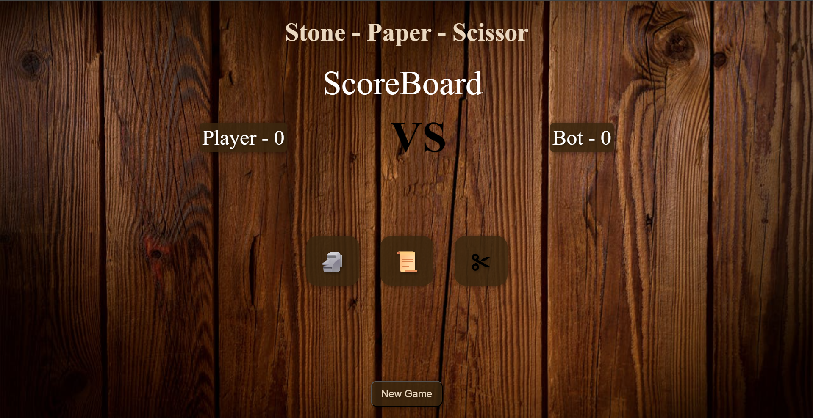

# 🪨 📄 ✂️ Stone Paper Scissors Game

A fun and interactive **Stone Paper Scissors** game built using **HTML, CSS, and JavaScript** — perfect to kill boredom and challenge your reflexes 😄.

---

## 🎮 How to Play

- Click on any one of the three buttons: **Stone**, **Paper**, or **Scissors**
- The computer makes its move randomly
- The winner is decided based on the classic rules:
  - 🪨 Stone beats ✂️ Scissors
  - 📄 Paper beats 🪨 Stone
  - ✂️ Scissors beats 📄 Paper

---

## 🛠️ Tech Stack

- **HTML** – Structure of the game
- **CSS** – Styling with cool visuals & effects
- **JavaScript** – Game logic, randomness, and DOM manipulation

---

## 🔊 Features

- Sound effects on winning or losing 🎧
- Simple yet colorful UI
- Responsive and lightweight
- Instant result updates

---

## 🚀 Live Demo

🔗 [Click here to play now](https://huzaifa-nath.github.io/stone-paper-scissors-game)

---

## 📸 Preview



---

## 🙌 Credits

Made with ❤️ by **[Huzaifa Nath](https://github.com/Huzaifa-Nath)**

---

## 📁 Clone and Run

```bash
git clone https://github.com/Huzaifa-Nath/stone-paper-scissors-game.git
cd stone-paper-scissors-game
open index.html # or just double-click it!
